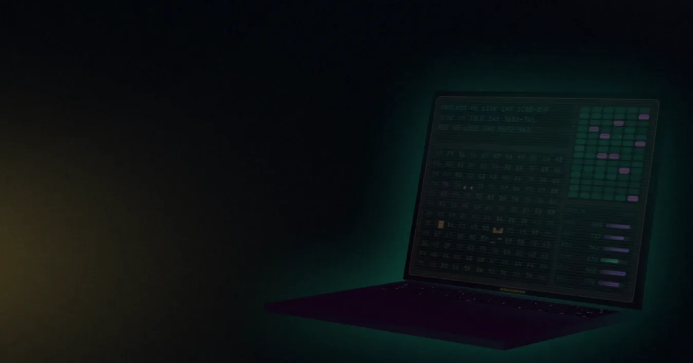

<a href="https://www.netoun.com"></a>

# netoun.com

**Hi, I'm Nicolas. Full-stack engineer & creative developer.**

`_❯` I build fast, polished web products, from expressive interfaces to robust backend systems. This is the source of my personal site: a night workbench of machine panels and warm paper, plus **Labs**, a playground of CSS 3D, canvas and shader experiments shown live with their source.`▐`

[`_VISIT THE SITE_ ↗`](https://www.netoun.com) &nbsp; [Explore the Labs →](https://www.netoun.com/labs/)

```text
_❯ fastfetch --logo netoun▐

            .::netounnetoun::.
        ::netounnetounnetounneto::           netoun@netoun.com
     .unnetounnetounnetounnetounneto.        -----------------
   .unnetounnetounnetounnetounnetounne.      Site:    static prerender · SSR off · no-JS safe
  :tounnetounnetounne:::tounnetounnetou:     Router:  React Router 8 · React 19
 nnetounnetounnetou  .   nnetounnetounnet    Lang:    TypeScript 7 strict · native tsc
:ounnetou:.:nneto: .un    netounnetounnet:   Build:   Vite 8 · Rolldown · Oxc · Bun 1.4
ounnetou    nnet: :oun    netounnetounneto   Style:   Vanilla Extract · zero-runtime CSS
unnetoun    net: :ounn:   etounnet..ounnet   Motion:  Anime.js 4 · one house curve
ounnetou    :n: .netoun   :neto: :unnetoun   Render:  WebGPU → WebGL → CSS
:netounn    :: .etounnet.  ::..:ounnetoun:   A11y:    React Aria · reduced motion
 netounne     :tounnetounn:::etounnetounn    Test:    Vitest 5 · happy-dom
  :etounne:::tounnetounnetounnetounneto:     Lint:    oxlint · oxfmt · knip
   .unnetounnetounnetounnetounnetounne.      Host:    Cloudflare Pages
     .tounnetounnetounnetounnetounne.        License: MIT (code)
        ::tounnetounnetounnetoun::
            .::netounnetoun::.
```

## `_01 /` THE SITE

<sub>EACH SECTION RUNS ITS OWN MACHINE PROCEDURE</sub>

Two dark machine panels bookend a workbench of warm paper. Every value on the page is derived from data or from the build, never typed by hand, and all of it is prerendered: readable without JS, still under `prefers-reduced-motion`.

| Section        | Procedure                                                                                                                                                     |                                                                  |
| -------------- | ------------------------------------------------------------------------------------------------------------------------------------------------------------- | ---------------------------------------------------------------- |
| **Hero**       | A WebGPU / WebGL mesh of gold, mint and violet light under film grain, a CSS-3D laptop that boots, and a spec layer printing the code the hero is built from. | [`_SOURCE_`](app/pages/welcome/sections/welcome-hero)            |
| **Projects**   | `netoun ps --projects`: the projects as an `htop` process monitor.                                                                                            | [`_SOURCE_`](app/features/projects/components/project-monitor)   |
| **Experience** | `netoun log --graph --all`: the work history as a git graph.                                                                                                  | [`_SOURCE_`](app/features/experiences/components/experience-log) |
| **Skills**     | `fastfetch --logo netoun`: the stack as a fetch readout, every tool with the receipt of where it ships.                                                       | [`_SOURCE_`](app/features/skills/components/skill-fetch)         |
| **Footer**     | `ESTABLISH LINK`: a CSS-3D server rack patching a cable into the contact you point at.                                                                        | [`_SOURCE_`](app/components/layouts/footer)                      |

## `_02 /` LABS

<sub>CSS 3D, CANVAS AND SHADER EXPERIMENTS, LIVE WITH THEIR SOURCE</sub>

| Experiment               | Technique                                                                      |                                                                                                                                   |
| ------------------------ | ------------------------------------------------------------------------------ | --------------------------------------------------------------------------------------------------------------------------------- |
| 3D Computer              | A retro workstation built entirely with CSS 3D transforms, no WebGL.           | [`_LIVE_ ↗`](https://www.netoun.com/labs/computer-3d) [`_SOURCE_`](app/features/labs/experiments/computer-3d)                     |
| 3D Server Rack           | A stacked server rack in CSS 3D with deterministic, seed-driven status LEDs.   | [`_LIVE_ ↗`](https://www.netoun.com/labs/server-unit-3d) [`_SOURCE_`](app/features/labs/experiments/server-unit-3d)               |
| Holographic Project Card | Mouse-driven CSS 3D tilt, holographic sheen and parallax layers.               | [`_LIVE_ ↗`](https://www.netoun.com/labs/project-card-3d) [`_SOURCE_`](app/features/labs/experiments/project-card-3d)             |
| Glitch Signal Map        | A Canvas 2D signal grid with a per-cell state machine, throttled to 30fps.     | [`_LIVE_ ↗`](https://www.netoun.com/labs/glitch-signal-map) [`_SOURCE_`](app/features/labs/experiments/glitch-signal-map)         |
| Cybernetic Glyph Grid    | Canvas 2D hex pairs and glitch glyphs on a deterministic timer.                | [`_LIVE_ ↗`](https://www.netoun.com/labs/cybernetic-glyph-grid) [`_SOURCE_`](app/features/labs/experiments/cybernetic-glyph-grid) |
| Fake Console             | A faux boot console streaming log lines behind a blinking caret.               | [`_LIVE_ ↗`](https://www.netoun.com/labs/fake-console) [`_SOURCE_`](app/features/labs/experiments/fake-console)                   |
| System Metrics Panel     | An animated telemetry HUD, gauges easing toward shifting targets.              | [`_LIVE_ ↗`](https://www.netoun.com/labs/system-metrics) [`_SOURCE_`](app/features/labs/experiments/system-metrics)               |
| Film Grain Shader        | Multi-octave value-noise film grain in WebGL, supersampled for high-DPI.       | [`_LIVE_ ↗`](https://www.netoun.com/labs/grain-shader) [`_SOURCE_`](app/features/labs/experiments/grain-shader)                   |
| Mesh Gradient            | Three drifting colour blobs, a vignette and film grain in one fragment shader. | [`_LIVE_ ↗`](https://www.netoun.com/labs/mesh-background) [`_SOURCE_`](app/features/labs/experiments/mesh-background)             |
| Scroll Morph             | A scroll-driven scale and translate morph, scrubbed with a slider.             | [`_LIVE_ ↗`](https://www.netoun.com/labs/scroll-morph) [`_SOURCE_`](app/features/labs/experiments/scroll-morph)                   |

## `_03 /` RUN IT

<sub>BUN ≥ 1.4 · NODE 24 (.node-version)</sub>

```sh
bun install
bun run dev        # https://netoun.localhost via portless (may ask for sudo once to start the proxy)
bun run dev:vite   # plain Vite on http://localhost:5173
bun run check      # typecheck · lint · format · tests
bun run build      # prerender every route to build/client + sitemap.xml
```

<details>
<summary>All scripts</summary>

| Script                          | What it does                                                            |
| ------------------------------- | ----------------------------------------------------------------------- |
| `dev`                           | Dev server with HMR at https://netoun.localhost (portless)              |
| `dev:vite`                      | Same, plain Vite on a port (no proxy)                                   |
| `build`                         | Prerender every route to `build/client` + `sitemap.xml`                 |
| `check`                         | `typecheck` + `lint` + `fmt:check` + `test:run`                         |
| `typecheck`                     | Route typegen + `tsc`                                                   |
| `lint`                          | oxlint                                                                  |
| `fmt` · `fmt:check`             | oxfmt, write · check                                                    |
| `test` · `test:run` · `test:ui` | Vitest, watch · single run · UI                                         |
| `knip`                          | Unused files, exports and dependencies                                  |
| `generate-assets`               | `favicon.ico`, `apple-touch-icon.png` and the Open Graph image          |
| `generate-grain-tile`           | Bake the paper's film grain into `public/images/grain-tile@{1,2}x.webp` |
| `generate-logo-ascii`           | Print `public/logo.svg` as the Skills section's ASCII logo              |

</details>

## `_04 /` SOURCE MAP

<sub>WHERE THINGS LIVE</sub>

```text
app/
  components/   shared UI: layouts, primitives, misc (3D objects, canvas, shaders)
  features/     domains shared across pages: projects, experiences, skills, labs
  pages/        welcome (/) and labs (/labs, /labs/:slug)
  hooks/        animation priority, scroll reveal, pointer, paper grain
  styles/       tokens, motion, keyframes, breakpoints
scripts/        sharp generators: icons, grain tile, ASCII logo
public/         fonts, images, _headers, _redirects, llms.txt
```

- [PRODUCT.md](PRODUCT.md): audience, positioning, content rules
- [DESIGN.md](DESIGN.md): the design system, from tokens to the signature components
- [docs/architecture.md](docs/architecture.md): folders, naming and import rules (lint-enforced)
- [AGENTS.md](AGENTS.md): working guide for AI coding agents (`CLAUDE.md` imports it)

## `_05 /` SHIP

<sub>STATIC FILES ON CLOUDFLARE PAGES</sub>

No server, no API: `bun run build` prerenders every route to `build/client`, which Cloudflare Pages publishes (Node from `.node-version`, Bun from `packageManager`). Security and cache headers live in `public/_headers`, redirects in `public/_redirects`. CI runs `check`, `knip` and `build` on every push to `main` and on pull requests.

## `_06 /` LICENSE

<sub>THE CODE IS OPEN, THE IDENTITY IS NOT</sub>

- **Code**: MIT, see [LICENSE](LICENSE).
- **Content**: texts, project captures, the logo, the Open Graph image and the Netoun identity are © Nicolas Coulonnier, all rights reserved. Fork the code, make the site yours.
- **Fonts**: [Doto](public/fonts/Doto-OFL.txt) is under the SIL Open Font License 1.1. PP Neue Montreal is a commercial font by Pangram Pangram, not covered by this repository's licence: bring your own if you fork.

---

## `_❯ ESTABLISH LINK▐`

`01` [GitHub](https://github.com/netoun) &nbsp; `02` [LinkedIn](https://www.linkedin.com/in/nicolas-coulonnier-66416813b/) &nbsp; `03` [Email](mailto:netoun@proton.me)

<sub><code>● PWR</code> <code>● LAN</code> &nbsp;NETOUN.COM · PRERENDERED · CLOUDFLARE PAGES</sub> &nbsp; [](https://github.com/Netoun/netoun.github.io/actions/workflows/ci.yml)
